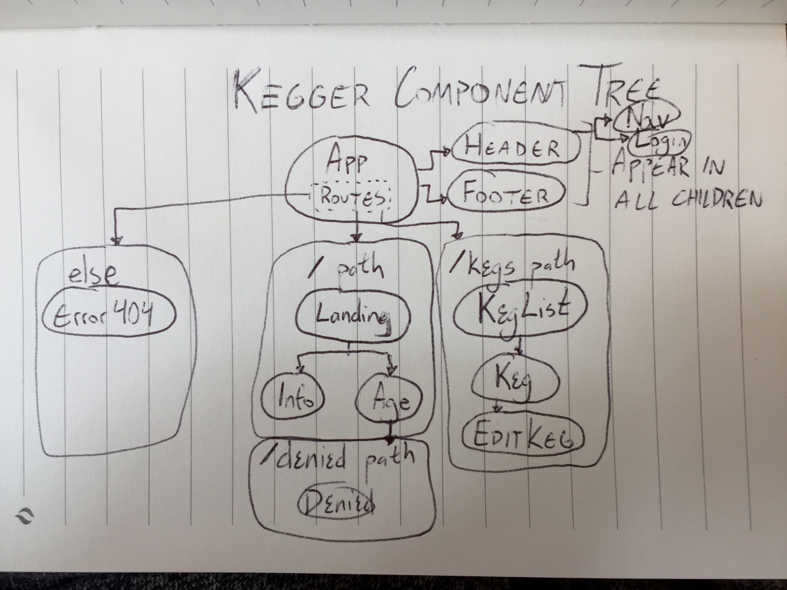

# Kegger - React

### Created by **Travis Toal**, 4/19/19

## Planning
* The planned structure of components is as follows:
* 

## Description (current)
* This is a React project, mimicking a previous Angular project.
* The website is a mock page for a Taproom. It is currently static, but I plan on making it more dynamic and interactive.

### Setup/Installation Requirements
* Open your preferred browser
* copy / paste
  https://github.com/travisty12/kegger-react
* Make sure you're in your Desktop directory
* Open your terminal and navigate to the chat directory
(cd desktop --cd kegger-react)
* Once in your terminal and proper directory run the command
* `npm install` (provided you are free of errors continue and run the next command)
* `npm run start` (should automatically open in your default browser)
*  This will result in running on a local host

## Known Bugs
_As of April 19th 2019 there are no known bugs_

## List of Technologies Resources
* HTML
* CSS
* React
* JavaScript
* JSX
* Webpack
* NPM

### License

_This software is licensed under the ISC license_

Copyright (c) 2019
**_Travis Toal_**  
